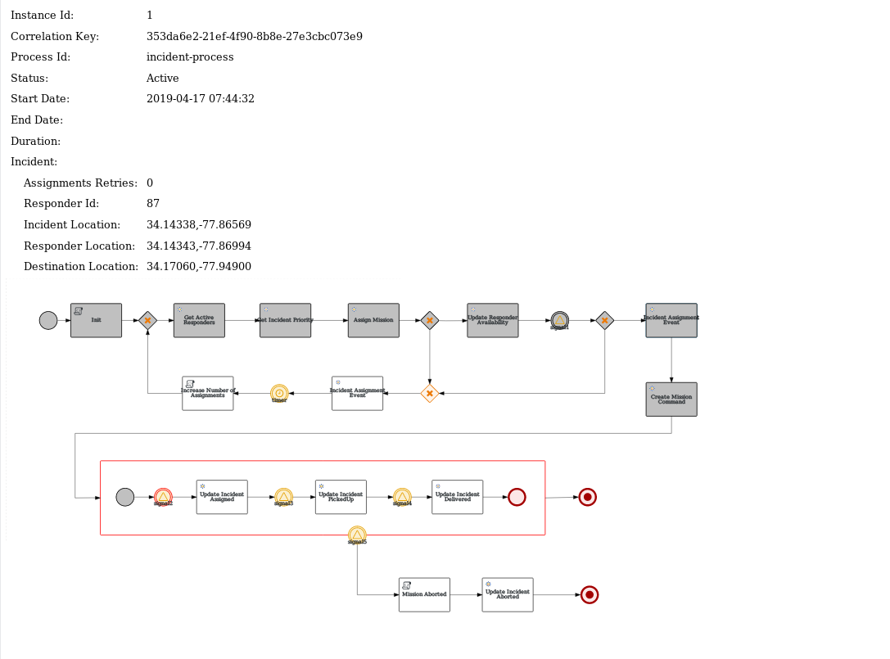

#### Process Instance Viewer

Tool to get information of process instances in the process engine of the process service, including a process diagram.

* Implemented with Vert.x, version 3.6.3.redhat-00009 (latest RHOAR  04/19)
* REST endpoint to get process information by incident Id:
  ```
  GET /data/process/instance/{incidentId}
  ```
* sample output:

  
